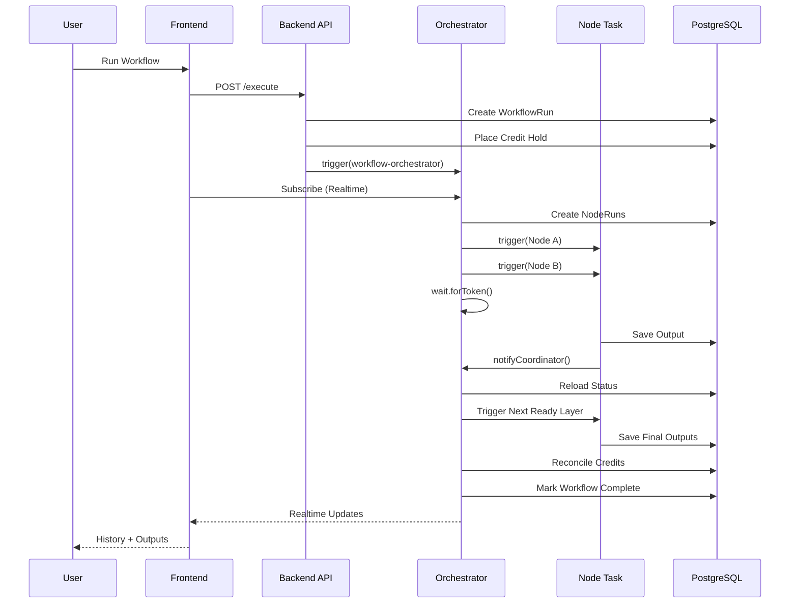
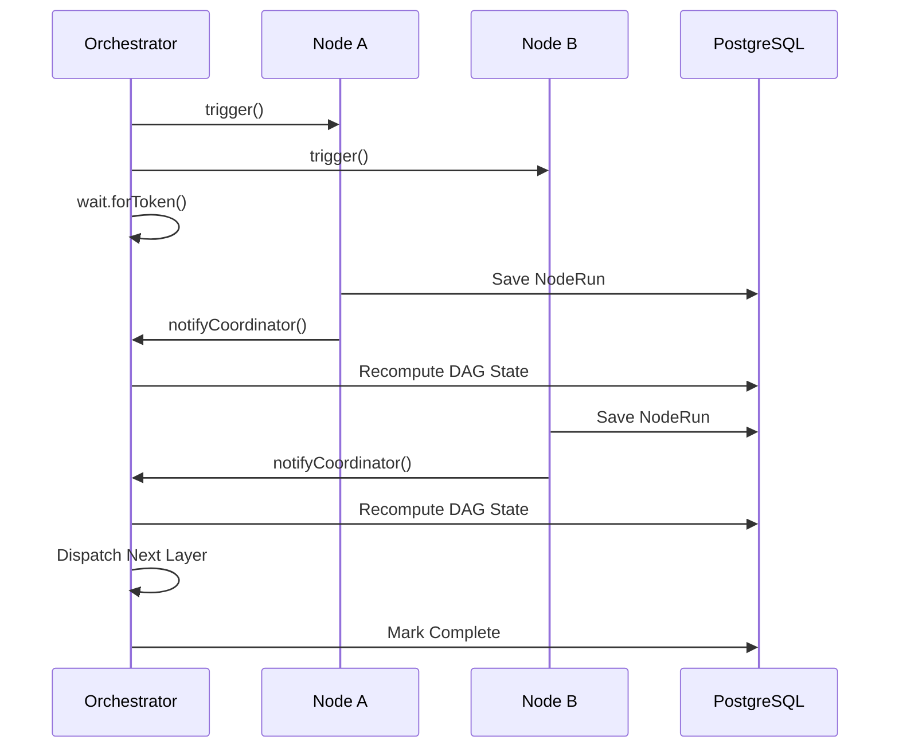

# Galaxy — Visual AI Workflow Builder (Backend)

Galaxy is a DAG-based visual builder for AI media workflows. Users drag nodes onto a React Flow
canvas, wire them together, and run the graph. Each node is an isolated Trigger.dev task with
Zod input/output schemas. Runs execute in parallel where the graph allows, stream live status
to the canvas, and are metered against a real credit ledger. The platform is also exposed as a
public REST API (`/api/v1`), OpenAPI 3.1 docs, and an MCP server for AI assistants.

**This repository:** API routes, Prisma, Trigger.dev tasks, `@galaxy/shared`. Companion UI:
**galaxy-temp-frontend**.

## Features

- Visual DAG workflow builder (React Flow)
- Schema-driven nodes (Zod, single `@galaxy/shared` source)
- Trigger.dev orchestration with coordinator-waitpoint pattern
- Config-driven provider fallback chains
- Live execution history and run-detail modals
- Credit ledger (hold, reconcile, ledger audit)
- Public REST API with Unkey or local API keys
- OpenAPI 3.1 docs and interactive playground (`/docs`)
- Outbound Svix-style webhooks
- MCP server (hosted HTTP + local StdIO)

## Repositories

| Path | Role | Stack |
|------|------|-------|
| `galaxy-temp-frontend` | Canvas UI, dashboard, history | Next.js 16, React 19, React Flow, Zustand |
| `galaxy-temp-backend` | API routes, Trigger.dev tasks, Prisma | Next.js 16 API, Prisma 7, Trigger.dev v4 |
| `galaxy-docs` | Public docs + OpenAPI | Mintlify |

Frontend and backend are separate deployments with their own `.git` and env. `@galaxy/shared`
lives in **this repo** (`shared/`) and is synced into the frontend at build time.

**Docs:** [docs/SETUP.md](docs/SETUP.md) · [docs/ENVIRONMENT.md](docs/ENVIRONMENT.md) · [docs/DATABASE.md](docs/DATABASE.md) · [docs/SYSTEM_DEEP_DIVE.md](docs/SYSTEM_DEEP_DIVE.md)

---

## Architecture overview

### Two runtimes, one database

```
Browser  --/api/*-->  Frontend (Vercel)  --rewrite-->  Backend (Vercel)  --Prisma-->  Postgres
     ^                         |                              |
     | useRealtimeRun          |                              | tasks.trigger
     +-------------------------+------------------------------+----> Trigger.dev workers
```

The frontend rewrites `/api/:path*` to the backend (`BACKEND_URL`), so the browser sends the
Clerk session cookie on the same origin. The backend uses non-blocking Clerk middleware and
returns `401` JSON from route handlers. Run **starts** on Vercel; the **DAG executes** on
Trigger.dev workers. Both need access to the same database; worker secrets are configured in
the Trigger dashboard separately from Vercel.

### Execution flow

End-to-end path from Run click to history update:



`POST /execute` returns `202` with `{ runId, orchestratorRunId, publicAccessToken }`. The client
subscribes to orchestrator metadata (`nodeStates`). On completion, credits reconcile and the
history panel refreshes. `restoreLiveRun()` re-attaches SSE after page reload if a run is still
active.

### Coordinator pattern (core design)

Instead of `triggerAndWait` per topological layer, one orchestrator dispatches ready nodes with
non-blocking `tasks.trigger`, parks on `wait.forToken`, and wakes when any node calls
`notifyCoordinator`. Scheduling state lives in Postgres — restart-safe and re-attachable.



The orchestrator never reads `providers[]` — only `node.type`, dependency resolution, and
`pending → running → completed/failed/skipped`.

### Provider fallback

Config-driven provider fallback: providers are defined per node in `@galaxy/shared` and executed
through a generic `runProviderChain()` (`trigger/provider-chain.ts`). Primary failure logs an
attempt and advances to the next provider; `providerUsed`, `providerAttempts`, and `logs` are
persisted on `NodeRun` for the history UI. Executor kinds: `openrouter`, `webhook-sim`, `ffmpeg`
(task-local), `stub`.

Full detail: [docs/SYSTEM_DEEP_DIVE.md](docs/SYSTEM_DEEP_DIVE.md)

### Credits

Microcredit ledger (1,000,000 micro = 1.00 credit). Flow: estimate in-scope `credits.base` →
`placeCreditHold` (Prisma transaction) → per-node `creditCost` → `reconcileWorkflowCredits`
(release hold, deduct actual, ledger refund/adjustment). New users receive an initial grant.

### Auth surfaces

| Surface | Mechanism | Routes |
|---------|-----------|--------|
| Dashboard / canvas | Clerk session + `userId` ownership | `/api/workflows/*`, `/api/execute/*`, `/api/keys`, `/api/credits` |
| Public API | Unkey or SHA-256 `ApiKey` table | `/api/v1/*` |
| MCP | Bearer API key | `/api/mcp` (hosted), `scripts/mcp-server.ts` (StdIO) |

### Outbound webhooks

`emitWebhookTask` posts Svix-style signed payloads for `run.started`, `run.completed`,
`run.failed`, and `node.completed`, with retries.

---

## Setup (this repo)

```bash
pnpm install
pnpm db:push
pnpm dev

# Trigger worker (second terminal, same repo)
npx trigger.dev@latest dev
```

Frontend + full stack: [docs/SETUP.md](docs/SETUP.md)

## Environment variables

See [docs/ENVIRONMENT.md](docs/ENVIRONMENT.md) for Vercel (frontend + backend), Trigger.dev
cloud, GitHub Actions (`TRIGGER_ACCESS_TOKEN`), and MCP client variables.

## Deployment

- **Vercel backend project** — API routes; `maxDuration = 60` for cold starts.
- **Trigger.dev workers** — `npx trigger.dev deploy` after task or `providers[]` changes; CI auto-deploys on `main` via `trigger-deploy.yml`.
- **Frontend + docs** — separate **galaxy-temp-frontend** and **galaxy-docs** deployments.

## Design decisions and trade-offs

**Coordinator-waitpoint vs `triggerAndWait` per layer.** Non-blocking dispatch + `wait.forToken`
avoids nested blocked parents on wide fan-out and zero idle compute during long provider waits.
Trade-off: more moving parts than literal layer-batching; functionally parallel and sequential
correct. State in Postgres enables `restoreLiveRun`.

**`medium-2x` for `merge-video`.** Default `small-1x` (512MB) OOMs on xfade + `libx264`. Task uses
`machine: "medium-2x"` with OOM retry to `large-1x`. Higher cost for that node only.

**Config-driven providers in `@galaxy/shared`.** One `runProviderChain`, unit-tested once; orchestrator
unchanged. FFmpeg stays task-local; webhook-sim timeout falls back to stub, not a third live provider.

**`@galaxy/shared` synced, not published.** Build-time single source of truth; frontend runs
`pnpm sync-shared` before build. `requestInputs` / `response` remain bespoke canvas nodes.

**Mid-run credit-exhaustion abort.** Before each layer, `checkNextLayerWithinHold` compares remaining hold (hold minus successful `creditCost` so far) to the next layer's estimate; overrun skips pending nodes, reconciles, and fails the run.

**Unkey + local mock fallback.** Production Unkey when configured; SHA-256 key table for dev/tests.

**Viewport in localStorage.** Per-device pan/zoom; graph JSON stays clean for API/MCP.

**Input limits.** Images: size + dimensions via **sharp** at `/api/upload`. Pre-run: sync validation
+ server HEAD for URL size (fail-open if unreachable). Video **duration** is declared in limits but
not probed pre-run (would need ffprobe per asset).

**Extra `gemini` / `cropImage` nodes.** Beyond minimum reference set; demonstrate schema-driven nodes.

**Custom Tailwind vs Shadcn/ui.** Hand-built UI in frontend repo; deliberate parity gap vs reference.

---

## What I'd improve with more time

- **MSW / API integration tests** for `/api/v1` (auth, 409 concurrency, rate headers) with mocked Unkey/OpenRouter/Transloadit.
- **Per-run graph snapshot** on `WorkflowRun` so history modals show deleted nodes.
- **Galaxy UI parity** — handle shapes, optional Shadcn audit.
- **External-run auto-attach** on an open canvas without refocus.
- **Video duration probing** at execute time (ffprobe); stricter policy for unreachable HEAD URLs.

---

## Testing

```bash
pnpm typecheck && pnpm lint && pnpm test
```

CI runs build, typecheck, lint, and tests; companion frontend repo runs Playwright smoke.
