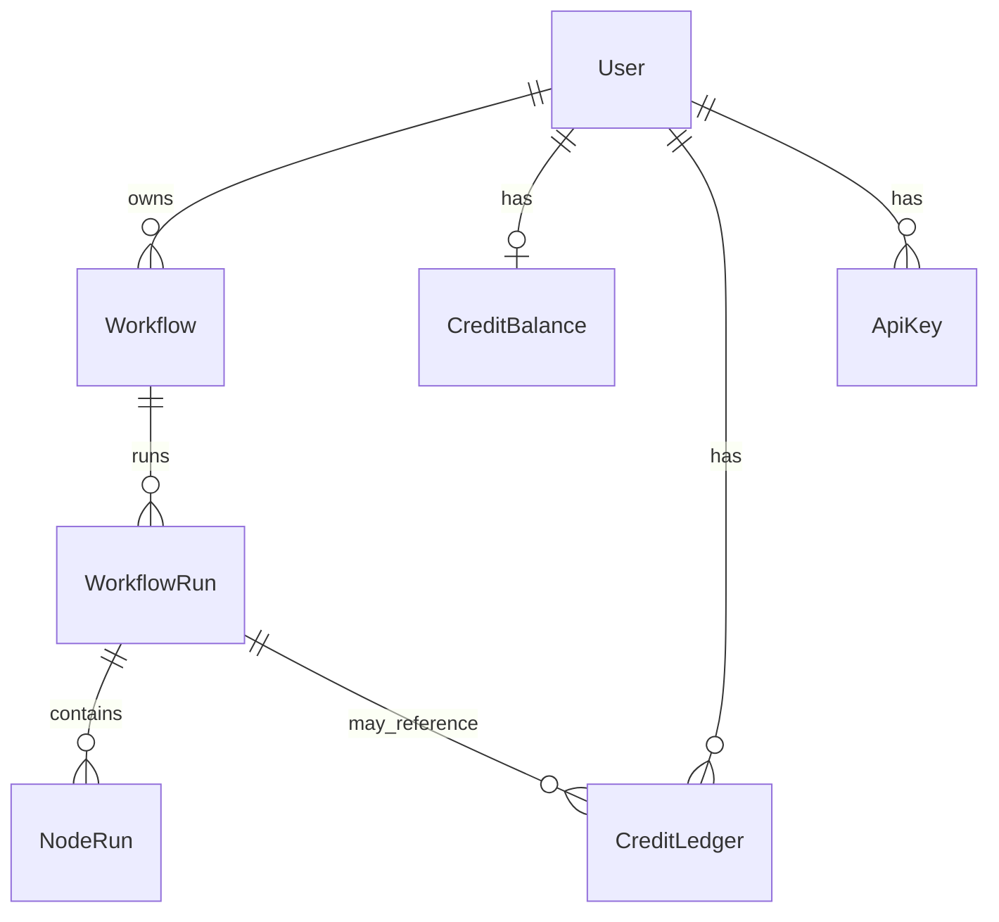
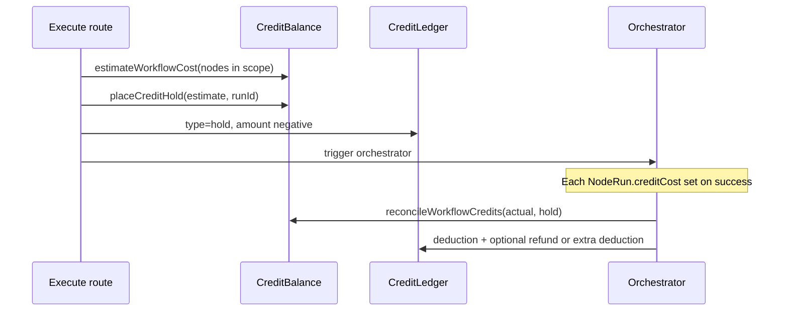

# Database

Galaxy uses **PostgreSQL** (Neon in production) via **Prisma 7**. Schema: `prisma/schema.prisma`. Connection: `DATABASE_URL` on Vercel and in the Trigger.dev dashboard (workers read/write `NodeRun` and credits).

---

## Commands

```bash
pnpm db:push      # apply schema (dev)
pnpm db:migrate   # migrations (if used)
pnpm db:seed      # demo user + sample workflow
pnpm db:studio    # Prisma Studio GUI
```

`postinstall` runs `prisma generate`. Trigger deploy bundles the Prisma client via `prismaExtension` in `trigger.config.ts`.

---

## Entity relationship



---

## Models

### `User`

| Field | Type | Notes |
|-------|------|--------|
| `id` | `String` PK | **Clerk `userId`** — not auto-generated |
| `createdAt` | `DateTime` | First upsert on workflow create/import |

Created lazily: `prisma.user.upsert({ where: { id: userId }, create: { id: userId } })` when the user creates or lists workflows. Credits balance is created on first `getOrCreateBalance`.

---

### `Workflow`

Persisted canvas graph and metadata. Owned by `userId` (all API routes scope by Clerk id).

| Field | Type | Notes |
|-------|------|--------|
| `id` | `cuid` | Primary key |
| `userId` | `String` | FK → `User.id` |
| `name` | `String` | Display name |
| `description` | `String?` | Optional |
| `nodes` | `Json` | React Flow nodes array (types, positions, `data.inputs`, `data.output`, Request fields, etc.) |
| `edges` | `Json` | React Flow edges (`source`, `target`, handles) |
| `status` | `String` | `idle` \| `running` \| `done` \| `error` (workflow-level chrome) |
| `webhookUrl` | `String?` | Outbound webhook target |
| `webhookSecret` | `String?` | HMAC secret for Svix-style signing |
| `createdAt` / `updatedAt` | `DateTime` | Autosave updates `updatedAt` |

**Not stored on workflow:** viewport pan/zoom (frontend `localStorage` only).

**Not stored per run (yet):** graph snapshot at run time — history modal uses current `nodes` + `NodeRun` rows; deleted nodes from past runs are not recovered (`graphSnapshot` is a planned addition).

---

### `WorkflowRun`

One execution of a workflow.

| Field | Type | Notes |
|-------|------|--------|
| `id` | `cuid` | Returned to client as `runId` |
| `workflowId` | `String` | FK → `Workflow` (cascade delete) |
| `userId` | `String` | Denormalized for queries / ownership |
| `scope` | `String` | `full` \| `partial` \| `single` |
| `status` | `String` | `success` \| `failed` \| `partial` |
| `startedAt` | `DateTime` | Default now |
| `finishedAt` | `DateTime?` | Set on completion |
| `durationMs` | `Int?` | End-to-end run duration |
| `orchestratorRunId` | `String?` | Trigger.dev orchestrator run id — SSE / `useRealtimeRun` |
| `inputValues` | `Json?` | Request-Inputs values at run start |

Concurrency: execute routes reject a new run if the workflow `status` is already `running` (409).

---

### `NodeRun`

Per-node execution record for a `WorkflowRun`. Upserted by the orchestrator; updated by `notifyCoordinator` when the Trigger task finishes.

| Field | Type | Notes |
|-------|------|--------|
| `id` | `cuid` | |
| `runId` | `String` | FK → `WorkflowRun` (cascade delete) |
| `nodeId` | `String` | Canvas node id |
| `nodeName` | `String` | Label at run time |
| `status` | `String` | `pending` \| `running` \| `success` \| `failed` \| `skipped` |
| `startedAt` / `finishedAt` | `DateTime` | |
| `durationMs` | `Int?` | |
| `inputs` | `Json?` | Resolved inputs passed to the task |
| `output` | `Json?` | Task output (shape from Zod schema — string or object) |
| `error` | `String?` | Failure message |
| `triggerRunId` | `String?` | Trigger.dev node task run id |
| `providerUsed` | `String?` | Winning provider id from `providers[]` |
| `providerAttempts` | `Json?` | `[{ providerId, status, durationMs, error? }, ...]` |
| `logs` | `String?` | Provider-chain log lines |
| `creditCost` | `Int?` | Microcredits charged for this node (usually `credits.base`) |

**Constraint:** `@@unique([runId, nodeId])` — one row per node per run.

History UI and run-detail modals read these fields. Live canvas uses orchestrator **metadata** (`nodeStates`) during the run, then persists outputs onto nodes / `NodeRun` on complete.

---

### `CreditBalance`

| Field | Type | Notes |
|-------|------|--------|
| `userId` | `String` unique | FK → `User` |
| `balance` | `Int` | **Microcredits** — default `100_000_000` (= 100.00 display credits) |
| `updatedAt` | `DateTime` | |

**Microcredit scale:** `1_000_000` micro = `1.00` display credit. UI often shows millions as `~1.71M` (divide by 1e6).

---

### `CreditLedger`

Append-only audit log for balance changes.

| Field | Type | Notes |
|-------|------|--------|
| `amount` | `Int` | Negative = debit/hold; positive = grant/refund |
| `type` | `String` | See types below |
| `description` | `String?` | Human-readable |
| `runId` | `String?` | Optional FK → `WorkflowRun` |
| `nodeRunId` | `String?` | Reserved; not always populated |
| `balanceAfter` | `Int` | Balance snapshot after entry |
| `createdAt` | `DateTime` | |

**Ledger types (in code):**

| `type` | When |
|--------|------|
| `initial_grant` | First `getOrCreateBalance` — 100M micro |
| `hold` | `placeCreditHold` before run — negative `amount`, linked `runId` |
| `deduction` | `reconcileWorkflowCredits` — actual cost; extra row if actual > hold |
| `refund` | Reconcile when hold > actual cost |
| `topup` | Schema comment only — not used in app code today |

---

### `ApiKey`

Dashboard-created API keys for `/api/v1` when not using Unkey-only keys.

| Field | Type | Notes |
|-------|------|--------|
| `keyId` | `String` unique | Public key id |
| `maskedKey` | `String` | Display mask (e.g. `gx_…xxxx`) |
| `name` | `String` | User label |

`verifyApiRequest` may use Unkey (`UNKEY_ROOT_KEY`) or SHA-256 hash lookup against stored key material (mock keys `gx_mock_*`). Raw secrets are not stored in plaintext in this table for production keys.

---

## Credit lifecycle (per run)



1. **Estimate** — sum of `credits.base` from `@galaxy/shared` for nodes in run scope (`registry.ts`).
2. **Hold** — atomic decrement of `CreditBalance` + `hold` ledger row.
3. **Actual** — sum of `NodeRun.creditCost` for successful nodes (failed nodes typically `0`).
4. **Reconcile** — release hold, deduct actual, write `refund` or additional `deduction` if hold ≠ actual.

**Mid-run guard:** Before each orchestrator layer, `checkNextLayerWithinHold` ensures
`remainingHold >= nextLayerEstimate` (hold minus successful `creditCost` so far). On failure,
pending nodes are skipped, the run is marked `failed`, and credits reconcile to actual spend.

Implementation: `lib/credits.ts`. Manual reconcile: `POST /api/workflows/[id]/runs/[runId]/reconcile`.

---

## JSON payloads (informal shapes)

**`Workflow.nodes`** — React Flow array; node `type` matches task dispatch (`openRouter`, `cropImage`, `requestInputs`, `response`, etc.).

**`Workflow.edges`** — `{ id, source, target, sourceHandle?, targetHandle? }[]`.

**`WorkflowRun.inputValues`** — map of Request field ids → values (strings, URLs, arrays for multi-image).

**`NodeRun.providerAttempts`** — example:

```json
[
  { "providerId": "main-openrouter", "status": "failed", "durationMs": 15012, "error": "timeout" },
  { "providerId": "backup-stub", "status": "success", "durationMs": 2100 }
]
```

**`NodeRun.output`** — per-node Zod output, e.g. `{ "response": "..." }`, `{ "outputVideo": "https://..." }`.

---

## Who writes what

| Writer | Tables |
|--------|--------|
| Next.js API (Clerk) | `User`, `Workflow`, `WorkflowRun` (create), `ApiKey`, credits hold |
| `workflow-orchestrator` | `NodeRun` upsert/status, `Workflow.status`, reconcile, `orchestratorRunId` on run |
| Node tasks via `notifyCoordinator` | `NodeRun` output, provider fields, `creditCost` |
| `emitWebhookTask` | reads `Workflow.webhookUrl` / `webhookSecret` only |

Trigger workers and Vercel API share the same `DATABASE_URL`.

---

## Seed data

`pnpm db:seed` creates `seed_user_demo` and a sample marketing workflow (Request → crop → OpenRouter → Response). Use for local demos; Clerk users get their own `User.id` from auth.

---

## Related docs

- [ENVIRONMENT.md](./ENVIRONMENT.md) — `DATABASE_URL` placement
- [SYSTEM_DEEP_DIVE.md](./SYSTEM_DEEP_DIVE.md) — orchestrator and credits in flow
- [SETUP.md](./SETUP.md) — `db:push` / `db:seed`
